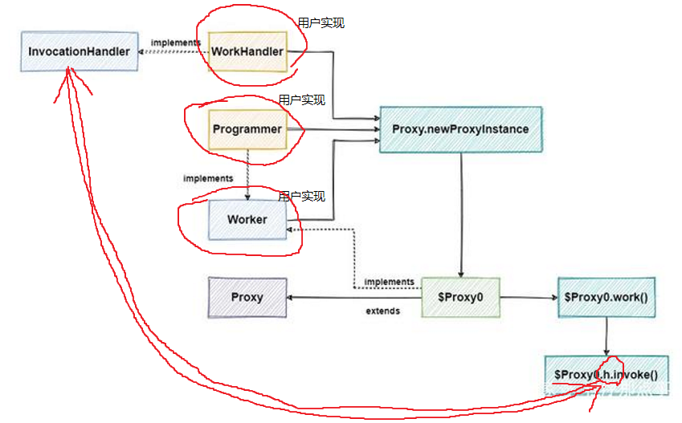

# jdk动态代理 # 

1. 横向：基于接口、基于继承
2. 纵向：类的组合
3. 为什么jdk的动态代理一定要基于接口呢？  
   要扩展一个类有常见的两种方式，继承父类或实现接口。这两种方式都允许我们对方法的逻辑进行增强，但现在不是由我们自己来重写方法，而是要想办法让jvm去调用InvocationHandler中的invoke方法，也就是说代理类需要和两个东西关联在一起：  
   * 被代理类
   * InvocationHandler  
   而jdk处理这个问题的方式是选择继承父类Proxy，并把InvocationHandler存在父类的对象中：  
   ```java
   public class Proxy implements java.io.Serializable {    
       protected InvocationHandler h;    
       protected Proxy(InvocationHandler h) {
           Objects.requireNonNull(h);
           this.h = h;
       }    
       //...
   }
   ```
   通过父类Proxy的构造方法，保存了创建代理对象过程中传进来的InvocationHandler的实例，使用protected修饰保证了它可以在子类中被访问和使用。但是同时，因为java是单继承的，**因此在继承了Proxy后，只能通过实现目标接口的方式来实现方法的扩展**，达到我们增强目标方法逻辑的目的。
4. $Proxy0$
```java
public final class $Proxy0 extends Proxy implements Worker{
    public $Proxy0(InvocationHandler invocationhandler){
        super(invocationhandler);
    }    

    public final void work(){
        try{
            super.h.invoke(this, m3, null);
            return;
        }catch(Error _ex) { }
        catch(Throwable throwable){
            throw new UndeclaredThrowableException(throwable);
        }
    }
    private static Method m3;
    static {
        //try{
            m3 = Class.forName("com.hydra.test.Worker").getMethod("work", new Class[0]);
            //省略其他Method
        //}// 省略catch
    }
} 
   
```
5. 
